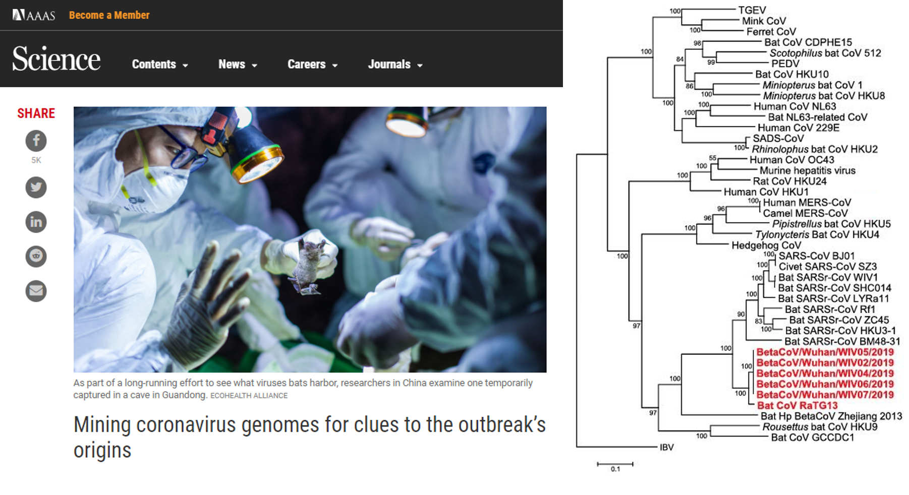
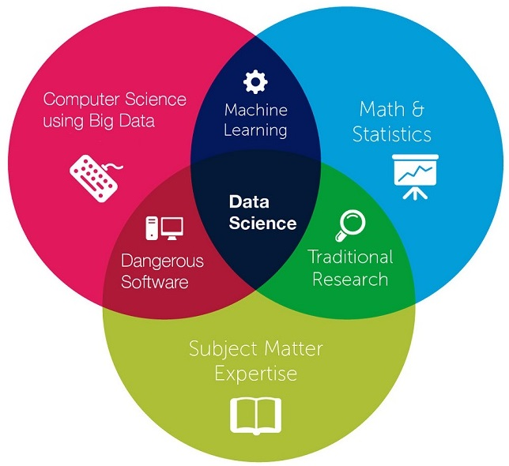
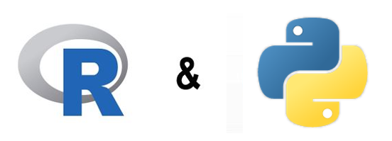
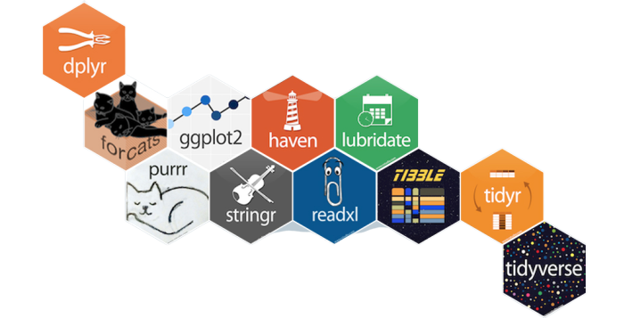
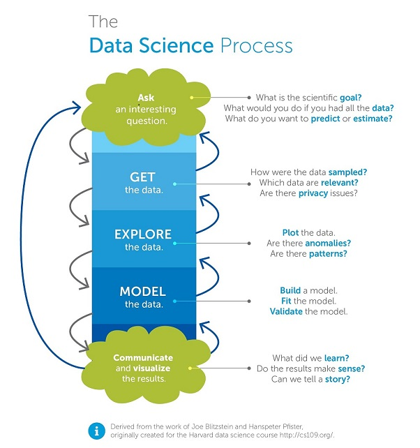

```{r, include=FALSE}
knitr::opts_chunk$set(
  message = FALSE,
  warning = FALSE,
  fig.asp = 0.75,
  fig.align = "center",
  out.width = "100%",
  collapse = TRUE,
  comment = "#>"
)

library(ggplot2)
library(tidyverse)
library(plotly)

```

# Learn Data Science by Building

## **What is Data Science?**

## An act of getting **powerful insights** from data

## **Data Science for Data-driven Industry**

<style>
.reveal section img { background:none; border:none; box-shadow:none; }
</style>


##



## **Multi-disciplinary Field**



## **The Toolset**



## Why learn R and Python?



* R & Python widely used in data science 
* Newbie Friendly
* Ready for Big Data

##


* Used by Major Companies
* Has a Large and Welcoming Community
* is Open Source

## 



# Happy Learning and Coding! :)
